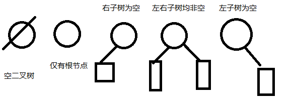

# 树的基础知识

## 0. 线性表

一对一的结构。

数组实现 `线性表` 。（除了第一和最后一个元素，其它元素都有唯一的前驱、后继）。
也可以用指针实现。

逻辑上可以通过不同方法。

## 1. 树

### 1.1 定义

一对多。

除了第一元素，其它元素都有一个或多个的前驱、后继。

有 n 个节点的有穷集合，满足：

1. 有且仅有一个称为根的结点。
2. 其余节点分为 m 个分支 (m >= 0) 个互不相交的非空集合 T1, T2, ..., Tm，这些集合中的每一个都是一棵树，称为根的子树。

（递归的定义）

### 1.2 表示方法

1. 图示表示（画出来）。
2. 广义表表示 : `= (T) = (1 (T1, T2, T3)) = (1(2(T11, T12), 3, 4(T31))) = (1(2(5, 6), 3, 4(7(T311, T312)))) = (1(2(5, 6), 3, 4(7(8, 9))))` （1表示树根编号，T为整个树，Tn 为第 n 个子树，数字为结点编号）。

(树没有顺序)

### 1.3 基本术语

#### 1.3.1 常见

树，树根，子树。

#### 1.3.2 度

结点的度：每个节点具有的子树的个数或者说其后继结点的个数被定义为该结点的度。
树的度：所有结点的度的最大值定义为该树的度。

#### 1.3.3 分支结点和叶结点

度大于 0 的结点称为分支结点或非终端结点，度为 0 的结点称为叶子结点。

#### 1.3.4 孩子结点、双亲结点、兄弟结点

每个结点的后继结点被称为该结点的孩子结点，相应的该结点被称为双亲结点或者父亲结点。具有同一双亲结点的孩子结点互称为兄弟节点。

（祖先节点，向上的所有结点。）

#### 1.3.5 树的深度和宽度

树中的结点的最大的层数称为树的深度或高度。

整棵树中某一层中最多的结点数称为树的宽度。

根结点的深度是 0 或 1。（看谁写的书）

### 1.4 二叉树

#### 1.4.1 基本概念

二叉树是一种特殊的树形结构，它是度数最多为 2 的树，即二叉树的每个结点最多有两个子结点。

有顺序！！！



#### 1.4.2 性质

1. 在二叉树的第 i 层上至多有 $$ 2^(i-1) $$ 个节点 (i >= 1)
2. 深度为 h 的二叉树至多有 $$ 2^h - 1 $$ 个节点 (h >= 1)。一棵深度为 k 且有 $$ 2^h - 1 $$ 个结点的二叉树称为满二叉树。
3. 对任何一个二叉树，如果其叶结点数 n0 ，度为 2 的结点数为 n2 ，则一定满足：n0 = n2 + 1。
4. 具有 n 个节点的完全二叉树的深度为 `trunc(log2(n)) + 1` （trunc：取整）
5. 对于一棵 n 个结点的完全二叉树，对于任何一个结点（编号为 i），如果 `i = 1`，则结点 i 为根，无父节点；如果 `i > 1` ，则其父结点编号为 `trunc(i/2)`。如果 `2 × i > n`，结点 i 无右孩子，否则右孩子编号为 `2i + 1`。

```plain
第二点例子推导：
(1111)2 = (10000)2 - (1)2 = 2^4 - 1

第三点例子推导：
　∵ n（节点个数） = n0 + n1 + n2
又∵ a（枝条个数） = n1 + n2 × 2
　∴ n1 + n2 × 2 + 1 = n
　∴ n0 = n2 + 1
```

#### 1.4.3 完全二叉树

深度为 k ，有 n 个结点的二叉树当且仅当其每一个结点都与深度为 k 的满二叉树中编号从 1 到 n 的结点一一对应时，称为完全二叉树。

（仅能最下层右边为空）

存储：直接放一维数组，使用完全二叉树的性质判别父节点、子节点。

#### 1.4.4 存储结构

##### 1.4.4.1 顺序存储

对一个完全二叉树的所有结点按层编号，将编号为 i 的结点存入一个一维数组的第 i 个单元。

非完全二叉树，也可以补全剩余成为完全二叉树存储，对于空的节点，直接放一个 `#` 或其他特殊符号。
但是会浪费大量的空间。

例：

| 1 | 2 | 3 | 4 | 5 | ... | n |
| - | - | - | - | - | --- | - |
| A | # | B | C | # | ... | Z |

##### 1.4.4.2 链式存储

```cpp
struct Node {
    char data;
    int left, right; // leftChild 和 rightChild
};
Node tree[1001]; // 一颗二叉树
```

| type | 1 | 2 | 3 | 4 | 5 | ... | n |
| ---- | - | - | - | - | - | --- | - |
| data | A | B | C | D | E | ... | Z |
| left | 2 | 3 | 4 | 0 | 0 | ... | 0 |
| right| 5 | 6 | 7 | 8 | 9 | ... | 0 |

#### 1.4.5 二叉树的建立

##### 1.4.5.1 顺序存储

```cpp
string s;
s = "LDPCFM###EH#N"; // L 在 下标 0 内
```

##### 1.4.5.2 链式存储

```cpp
L 2 3
D 4 5
P 6 0
C 0 0
F 7 8
M 0 9
E 0 0
H 0 0
N 0 0
```

直接存储输入。

#### 1.4.6 二叉树的基本运算

##### 1.4.6.1 输出运算

输出广义表，判断有无孩子。

##### 1.4.6.2 二叉树的遍历运算

###### 1.4.6.2.1 先序遍历

若二叉树不为空

1. 访问根节点
2. 先序遍历左子树
3. 先序遍历右子树

###### 1.4.6.2.2 中序遍历

1. 中序遍历左子树
2. 访问根节点
3. 先序遍历右子树

###### 1.4.6.2.3 后序遍历

1. 后序遍历左子树
2. 后序遍历右子树
3. 访问根节点

##### 1.4.6.3 求深度

若二叉树为空，则深度为 0 。
否则，深度 = 左子树与右子树中最大深度 + 1。

##### 1.4.6.4 实例

见 `code/course`。

#### 1.4.7 二叉排序树

##### 1.4.7.1 定义

二叉排序树性质：任何节点的值。。。

##### 1.4.7.2 建立

先生成一个节点，加入到树中，如果不是根节点，再根据大小决定这个结点是否插在某个节点。。。

##### 1.4.7.3 查找

从根节点开始，如果要查找的数与该节点不相等，则根据与该节点的值比较，选择。。。

#### 1.4.8 哈夫曼树

